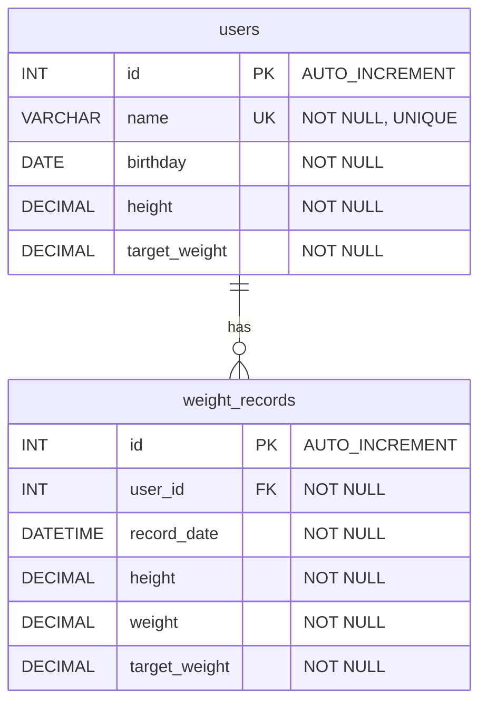

# Schema

```mermaid
erDiagram
    users {
        INT id PK "AUTO_INCREMENT"
        VARCHAR name UK "NOT NULL, UNIQUE"
        DATE birthday "NOT NULL"
        DECIMAL height "NOT NULL"
        DECIMAL target_weight "NOT NULL"
    }

    weight_records {
        INT id PK "AUTO_INCREMENT"
        INT user_id FK "NOT NULL"
        DATETIME record_date "NOT NULL"
        DECIMAL height "NOT NULL"
        DECIMAL weight "NOT NULL"
        DECIMAL target_weight "NOT NULL"
    }

    users ||--o{ weight_records : "has"
```
